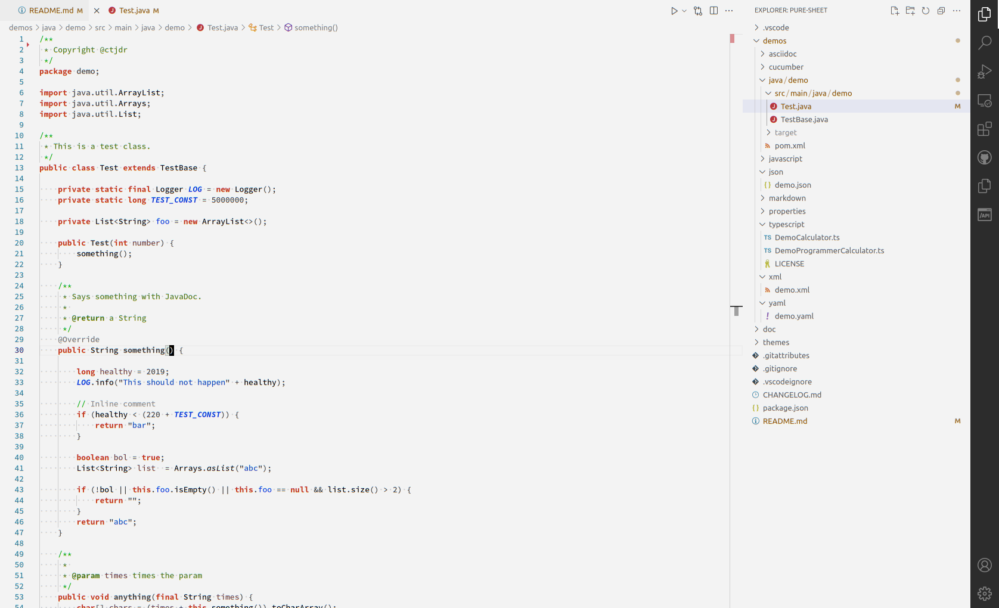

# Pure Sheet

An eye-friendly light VS Code color scheme based on the [Clean Sheet](https://fappel.github.io/xiliary/clean-sheet.html) theme.

## Language support

This theme should work with all languages but is especially tested with:

- Java
- XML
- JSON
- YAML
- Markdown
- Gherkin/Cucumber features
- AsciiDoc
- JavaScript
- TypeScript
