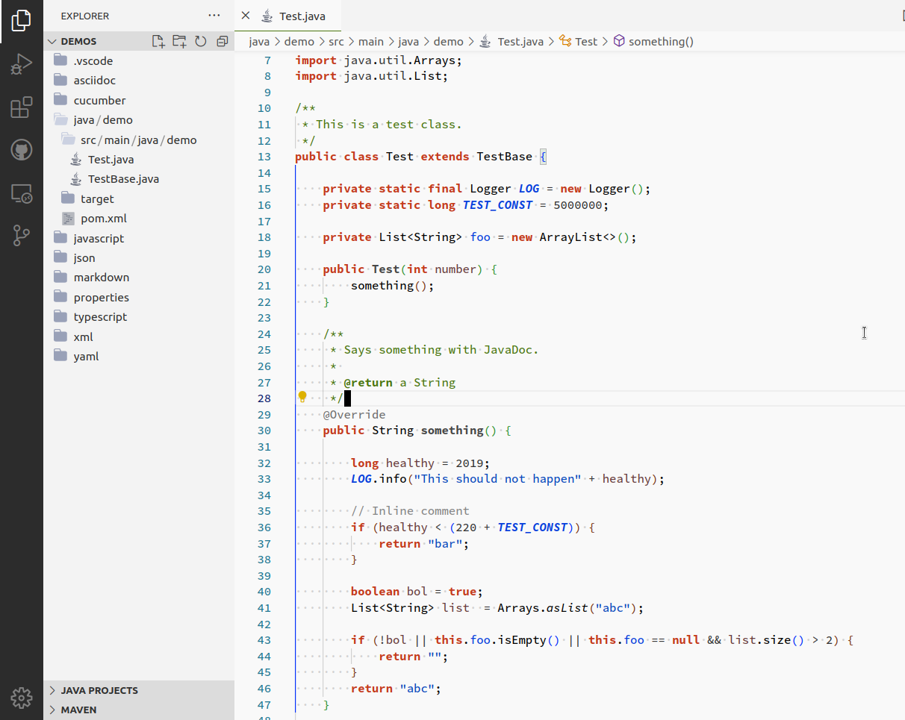

# Pure Sheet

An eye-friendly light Visual Studio Code color scheme based on the [Clean Sheet](https://fappel.github.io/xiliary/clean-sheet.html) theme.





## Installation

Directly install the "Pure Sheet" extension from Visual Studio Code, or [download from Visual Studio Code Marketplace](https://marketplace.visualstudio.com/items?itemName=ctjdr.pure-sheet).

## Font

The font used by the original Clean Sheet theme is _[Source Code Pro](https://fonts.google.com/specimen/Source+Code+Pro)_.
This is the font used in the above screenshots, too.

Here are the font settings in VS Code that worked best for me on Linux and Windows:

```json
    "editor.fontWeight": "500",
    "editor.fontFamily": "'Source Code Pro'",
    "editor.fontSize": 13 //Linux: 13, Windows: 14
```

## Language support

This theme should work with all languages but is especially tested with:

- Java
- JavaScript
- TypeScript
- Markdown
- JSON
- YAML
- XML
- Gherkin/Cucumber features
- AsciiDoc

To get proper results you need to install the accoding language support extensions.
Otherwise semantic highlighting will not work and you won't get a result similar to Clean Sheet on Eclipse.